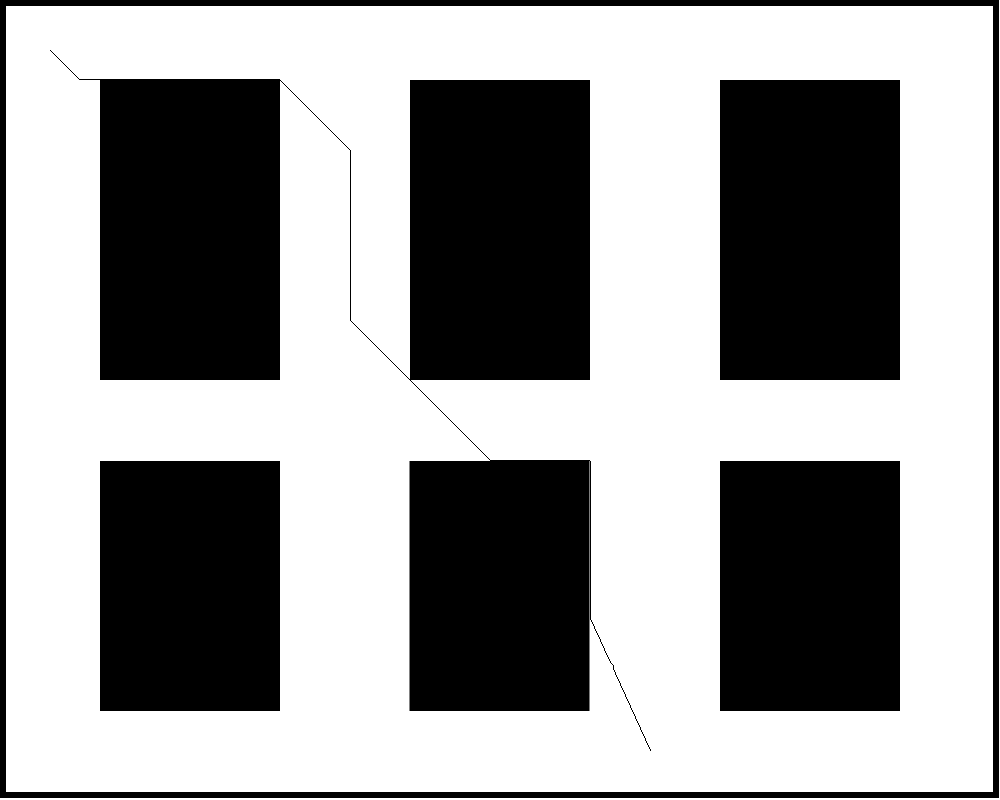
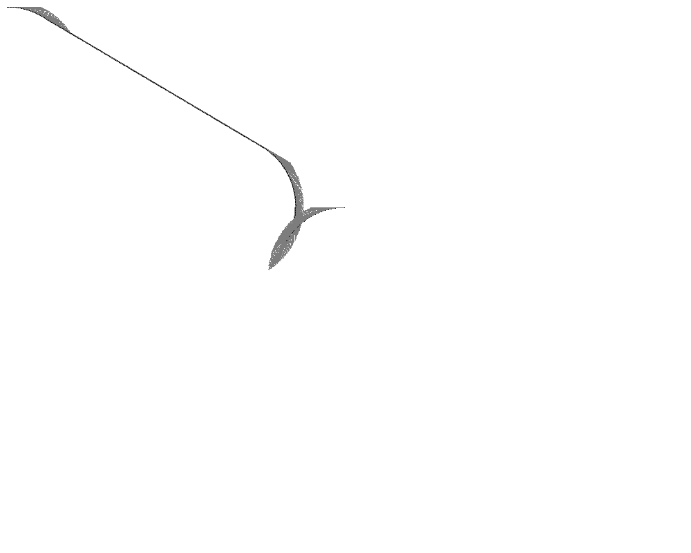
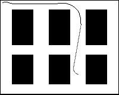

# hybrid_astar
混合A*算法，仅依赖于很少的库，便于移植到自己的项目中或者嵌入式系统

## 更新进度

* 2021.4.25 添加原始的A*算法和地图读取代码，采用opencv库读取图片作为地图
* 2021.4.26 添加ReedsShepp算法
* 2021.4.27 添加混合A*算法
## 用法

### 获取地图数据
地图数据采用图片进行保存，这样直观且采用opencv库直接读取就好

`test/test_map.cpp`文件中为地图数据读取示例

### 原始A*路径搜索
`test/test_A_star.cpp`文件中给出原始的A*算法调用示例，原始的A *算法将被用在混合A *中计算预估代价H 
1. 读取地图信息
2. 调用plan接口进行路径规划
3. 可视化数据

成功运行结果为下图

### ReedsShepp算法 

`test/test_ReedsSheppPath.cpp`文件中给出ReedsShepp算法的运行示例，该算法提供了一个不考虑障碍物仅考虑运动学时的一个路径规划方法，在实际的混合A*算法中用于计算预计代价H，并尝试计算当前搜索点与目标点的路径，如果该路径没有障碍物则可以提前结束搜索。

示例代码实际运行结果应该如下图

### 混合A*算法
`test/test_hybrid_aStar.cpp`文件提供了单纯运行混合A*star算法的示例，需要注意的是，这里发现原算法如果在较大的搜索空间内需要花费较多的时间进行搜索，因此在实现中添加了缩放系数，即A *和混合A *离散空间的大小，缩放系数为1时不缩放，为0.5时搜索空间减小为四分之一。

### 依赖项目

* opencv （读取地图文件，也可以自行定义地图数据，而不调用opencv）
